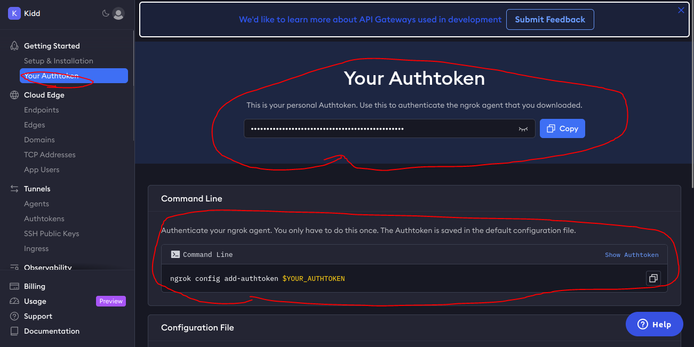
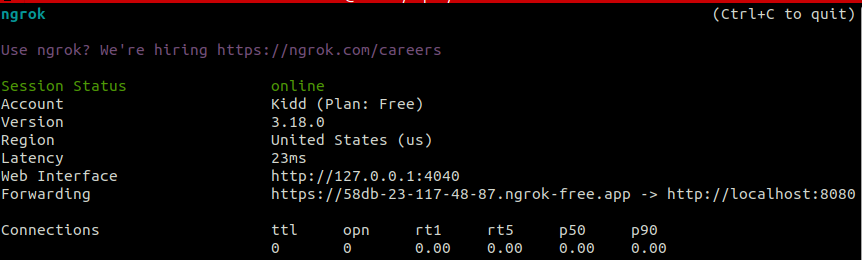
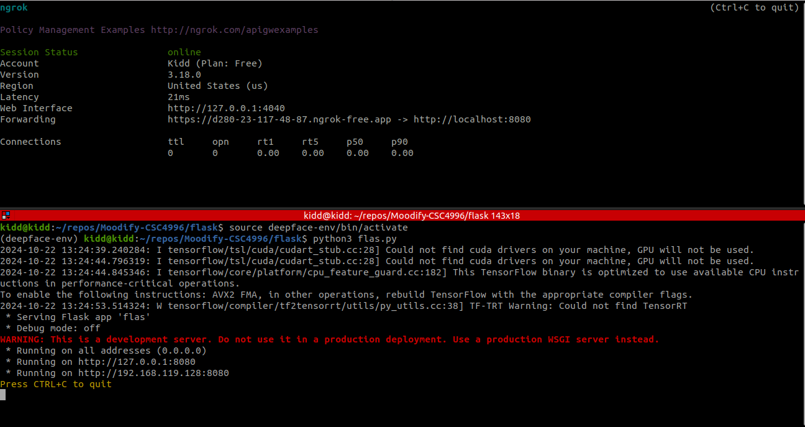

# Moodify-CSC4996

## Downloading Ngrok
Goto the website: https://ngrok.com/ And create an account

Once you create an account, grab your auth token here and add the authtoken


Finally, goto this download page to download ngrok: https://ngrok.com/download

## Setting up flask code
The flask code is located in the Flask folder. 

Filename: flas.py

```py
if __name__ == '__main__':
    app.run(host='0.0.0.0', port=8080)
```
Note: if you change the port, make sure to change it here too

## Running emotion detector server side
Run these commands in the terminal to setup emotion detection on the server side

### Setup ngrok server
you can use any port, but in this case 8080 is used
```terminal
ngrok http 8080
```
It should look like this

Everytime you run ngrok again, you have to grab the new url and put it in the homePageView.swift

In the example of the picture above: is the new url to be used

https://58db-23-117-48-87.ngrok.free.app

### Updating homePageView

Then you also have to update this line in homePageView.swift

```swift
struct homePageView: View {
    ...
    let backendURL = "https://a46d-2601-406-4d00-7af0-d964-735f-448-6a6a.ngrok-free.app/analyze"
    ...
```

Ensure you add /analyze to the end of the link, exactly as shown above

### Setup virtual env
#### Run this command in the flask folder to build the virtual env
```terminal
python3 -m venv deepface-env
```

#### Run this command in the flask folder to activate the virtual env
```terminal
source deepface-env/bin/activate
```

#### It should look like this


### Install these dependencies in order to run the flask code

```terminal
pip install flask
```

```terminal
pip install deepface
```

```terminal
pip install tf-keras
```

### Run flask code
```terminal
python3 flas.py
```

## After following all the steps, your terminal should look like this
Top terminal = ngrok http 8080
Bottom terminal = python3 flas.py


And finally, moodify utilize flas.py to process the emotion detection 